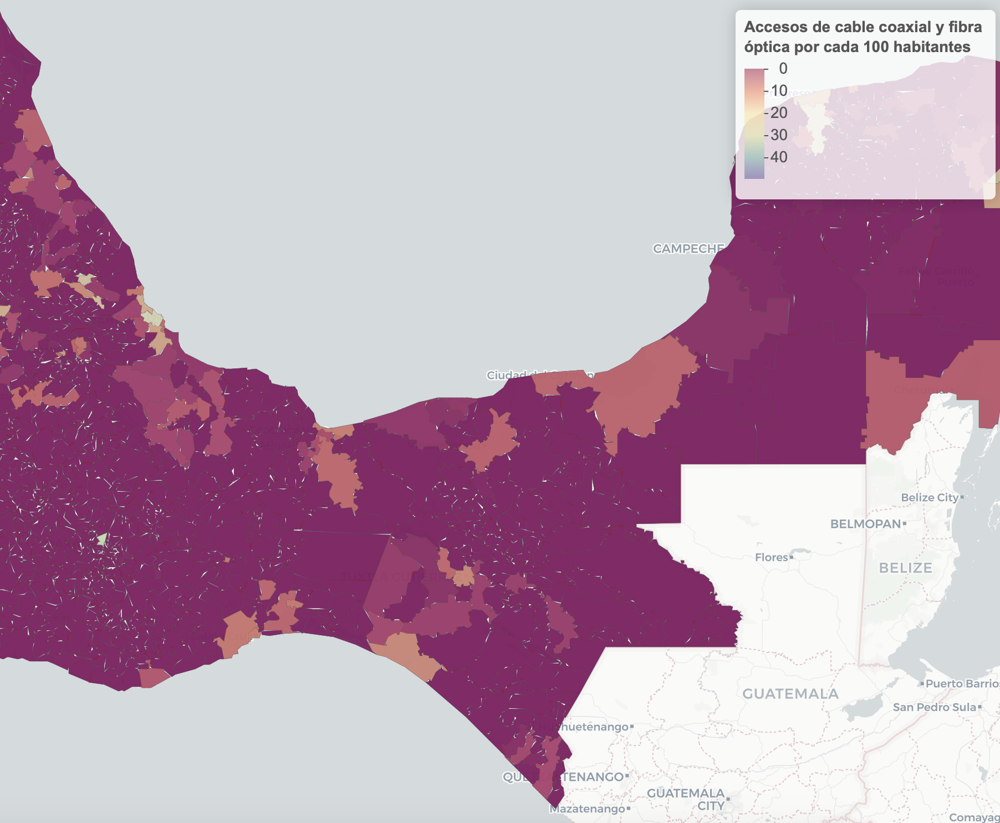

# Penetration of Fixed Broadband for high speed technologies
A map to analize
[fixed broadband data for Mexico](https://github.com/czammar/BandaAnchaFija)
considering penetration for technologies that can bring high speed services
(optical fiber and coaxial cable) at municipal level for Mexico at June 2019.

It is based on an OCDE metric to quantify penetration within a zone
 (http://www.oecd.org/internet/broadband/broadband-faqs.htm), considering the
 number of Fixed broadband subscriptions per 100 inhabitants

**Notes:**

* Considers broadband access technologies of optical fiber and coaxial cable for
 local loop deployed in Mexico until June 2019, as a proxy the ones that can
provide high speed to end users.
* There is no public data for VDSL access, and also not all Mexican operators
that have deployed coaxial cable use DOCSIS 3.0 or grater, so comparative has
limitations.
* Demographical data is limited to census exercises of 2015, due to COVID 2019.
* We use R library *mxmaps* (https://www.diegovalle.net/mxmaps/).

## 1. Instructions

Data gathering, wrangling and map generation are base mostly on Bash and
R scripts. Please do as follows:

## 1.1 Data Sources

**Household and population data for Mexico in 2015**

Source: Encuesta Intercensal 2015, from INEGI, Mexico. You can download it using
 the following terminal commands:

```
# Dowload household and population data for Mexico in 2015
wget -i ./data/Intercensal2015/urls_hogares.txt -P ./data/Intercensal2015/
wget -i ./data/Intercensal2015/urls_poblacion.txt -P ./data/Intercensal2015/
```

**Fixed Broadband access data for Mexico**

Source: Banco de Información de Telecomunicaciones of Instituto Federal de
Telecomunicaciones (México, https://bit.ift.org.mx/BitWebApp/). This give data
for all local loop technologies present in Mexican Market (e.g xDSL, Optical
  Fibre, Coaxial Cable). Data was placed in **/data/TODO_BAF**

**Geographic information for Mexico**

Source: Marco Geoestadístico, INEGI https://www.inegi.org.mx/temas/mg/

## 1.2 Generation Maps

Just run R script

```
Maps-FixedBroadBand.R
```

An interactive map named as
[**fixed-broadband-map-mexico.html**](https://rpubs.com/czammar/fixedbroadbandMX)
is generated in current directory.

## 2. Remarks

* Within OCDE Countries, Fixed broadband subscriptions per 100 inhabitants
(considering all posible technologies for local loop) was close to 30.9
(http://www.oecd.org/sti/broadband/1.1-TotalBBSubs-bars-2019-12.xls), at
December 2018. In case of Mexico, Fixed broadband subscriptions per 100
inhabitants was close to 14.8.

* Eventually we can update this map, but new demographic data should be available.

* OCDE gave following note from it's penetration metric
(http://www.oecd.org/digital/broadband/broadband-faqs.htm):

  * **Why does the OECD express subscribers "per 100 inhabitants" instead of as
   a percentage of households?**

    OECD subscriber data contains the total number of business and  residential
    subscriber lines in a country. Normalising the number of  broadband
    subscribers by the population provides an idea of relative  penetration of
    subscriber lines. Expressing the number of subscriptions  in terms of
    households would be misleading because some connections are  to businesses.
    Normalising subscribers as a percentage of total  households would
    consistently over-estimate broadband penetration.

------

**Center of Mexico**


**Peninsula de Yucatán**


**Center-South of Mexico**



